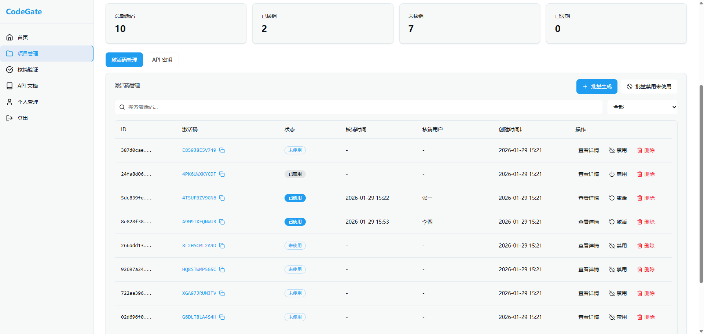
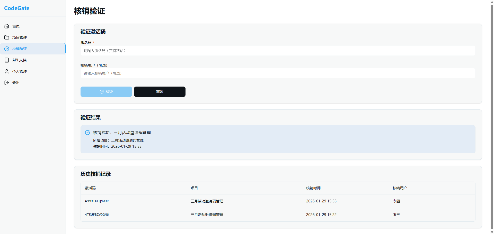
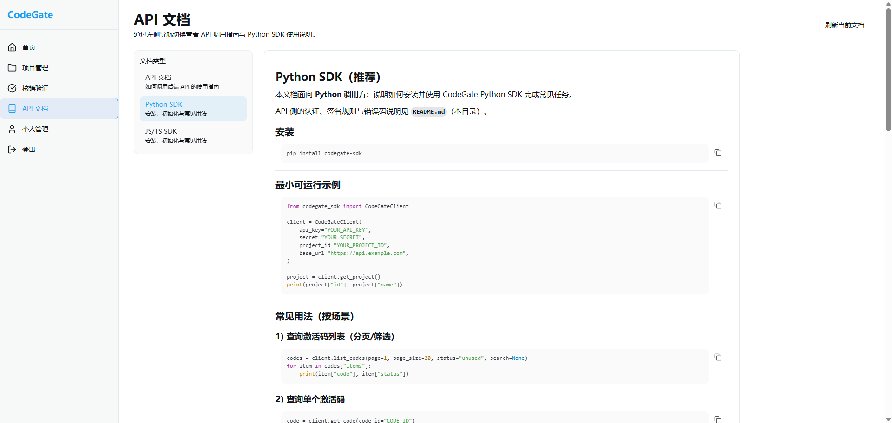

# CodeGate

CodeGate 是一个轻量级 Python 后端服务，专注于 **激活码、邀请码、验证码（OTP）** 的生成、过期、验证和管理。它提供 **REST API** 和 **Python SDK**，可以 **独立运行** 或 **嵌入其他系统**，非常适合 **SaaS 平台、移动应用、游戏、会员管理系统** 等场景。

## 项目初衷

开发项目会遇到反复重新开发邀请码、激活码模块，为了提高效率、避免重复劳动，本项目抽象并实现了通用的激活码/邀请码/验证码服务。致力于：

- **高可复用性**：项目间可直接集成，解耦业务，仅需少量配置即可使用。
- **接口易用性**：同时提供 REST API、Web 管理后台和 Python/JS 等主流 SDK（如果有其他语言 SDK 需求，欢迎提 issue、pr）。
- **低侵入性**：不依赖具体业务，只关注激活码全生命周期管理，兼容多种上游系统。

## 截图预览







## 功能特性

- **项目管理**：创建、更新、查询、删除项目，支持项目级别的激活码管理，支持启用/禁用项目
- **批量生成激活码**：支持自定义格式（长度、前缀、后缀），支持为激活码设置独立的过期时间
- **激活码管理**：支持激活码的禁用/启用操作（单个和批量），支持重新激活已使用的激活码
- **激活码验证/核销**：通过 API 或界面进行核销验证，支持防重复核销，自动检查过期状态
- **自动过期管理**：基于项目有效期或激活码独立过期时间自动检查，定时任务自动更新过期状态
- **管理员认证**：安全的管理员登录系统，使用安全 Cookie 进行权限验证，支持首次登录强制修改密码
- **个人管理**：管理员可以修改自己的密码，查看个人信息
- **项目概览**：提供全局统计信息和最近核销记录
- **Web UI 和 REST API**：提供 Web 界面和 RESTful API 两种使用方式
- **状态管理**：完善的激活码状态管理（未使用/已使用、启用/禁用、未过期/已过期）

## 技术栈

- **后端**: Python 3.12+, FastAPI, SQLAlchemy ORM
- **数据库**: SQLite / PostgreSQL（可选）
- **前端**: Next.js（React）+ Tailwind CSS
- **部署**: Docker / docker compose（见 `deploy/`）
- **API 文档**: FastAPI 自动生成 OpenAPI/Swagger 文档（`/docs`、`/redoc`）

## 快速开始

本仓库包含三部分：

- **后端服务**：`backend/`
- **前端站点**：`frontend/`
- **SDK**：`sdk/`（JavaScript + Python，如果有其他语言 SDK 需求，欢迎提 issue、pr）

### Docker 部署

#### 方式一：源码构建

最小化部署：**1 个后端容器（SQLite）+ 1 个前端容器**，使用仓库内 Dockerfile 构建镜像（详情见 `deploy/README.md`）：

```bash
cd deploy
cp .env.example .env
docker compose up -d --build
```

此方式会在本地构建 `codegate-backend` / `codegate-frontend` 镜像，适合需要修改源码或二次开发的场景。

#### 方式二：快速开始

可直接拉取使用（无需本地构建）：

```bash
docker pull pfeak/codegate:latest
```

快速启动一体化容器（前端 + 后端在同一容器中，默认端口：`8877`）：

```bash
docker run -d \
  --name codegate \
  -p 8877:8877 \
  -v $(pwd)/data/codegate:/app/backend/data \
  pfeak/codegate:latest
```

也可以使用仓库内的一体化 compose 配置（`deploy/onebox/docker-compose.yml`）。

启动后：

- 访问界面：`http://localhost:8877`

## SDK

本项目自带 **Python**、**JavaScript/TypeScript** 官方 SDK。你可以通过 pip/npm 直接安装，也可参考 [快速开始](https://docs.codegateapp.com/quickstart) 文档：

### Python 安装

```bash
pip install codegate-sdk
# 或使用 uv
uv pip install codegate-sdk
```

### JavaScript/TypeScript 安装

```bash
npm install codegate-sdk
```

### 基本用法示例

#### Python

```python
from codegate_sdk import CodeGateClient

client = CodeGateClient(
    api_key="你的API_KEY",
    secret="你的SECRET",
    project_id="你的PROJECT_ID",
    base_url="http://localhost:8877"  # 或你的部署 API 地址
)

result = client.verify_code(code="ABC12345", verified_by="user123")
if result['success']:
    print(f"核销成功，时间: {result['verified_at']}")
else:
    print(f"核销失败: {result['error_code']} - {result['message']}")
```

#### JavaScript/TypeScript

```typescript
import { CodeGateClient } from 'codegate-sdk';

const client = new CodeGateClient({
  apiKey: '你的API_KEY',
  secret: '你的SECRET',
  projectId: '你的PROJECT_ID',
  baseUrl: 'http://localhost:8877', // 或你的部署 API 地址
});

const result = await client.verifyCode({ code: 'ABC12345', verifiedBy: 'user123' });
if (result.success) {
  console.log('核销成功，时间:', result.verified_at);
} else {
  console.log('核销失败:', result.error_code, result.message);
}
```

具体参数、环境变量等更多用法详见：[SDK 文档（Python）](https://docs.codegateapp.com/sdk/python) | [SDK 文档（JavaScript/TypeScript）](https://docs.codegateapp.com/sdk/javascript)

其他语言 SDK 需求欢迎 [提 issue](https://github.com/pfeak/codegate/issues) 交流。

## 文档入口

- **后端**：`backend/README.md`
- **前端**：`frontend/README.md`
- **Docker 部署**：`deploy/README.md`
- **SDK**：`sdk/README.md`

## License

Apache License 2.0 - 详见 [LICENSE](LICENSE) 和 [NOTICE](NOTICE)
